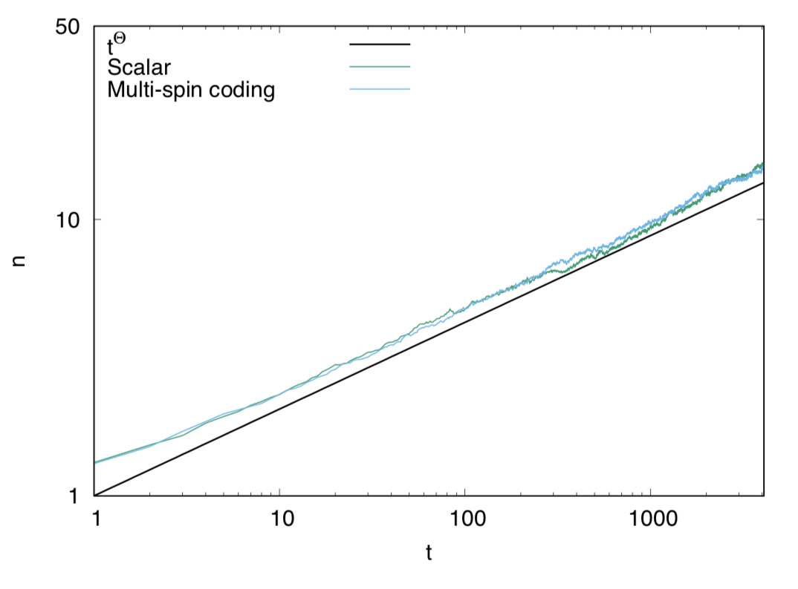
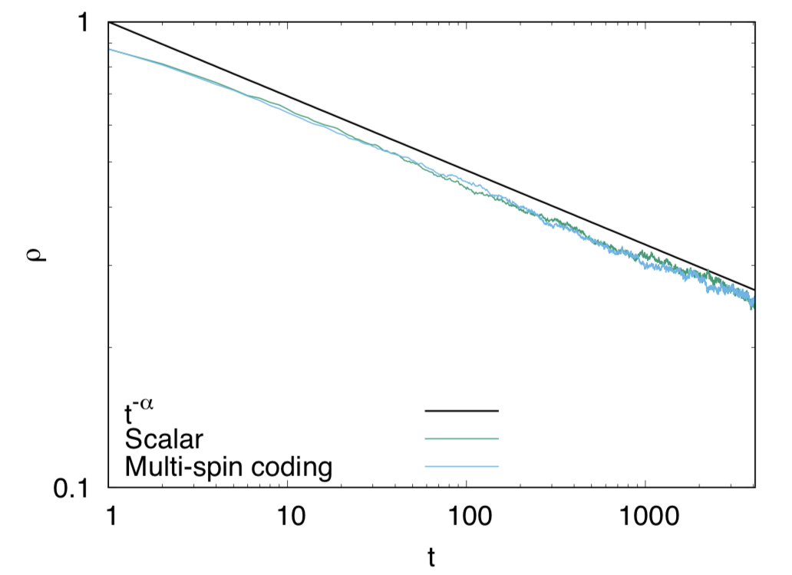
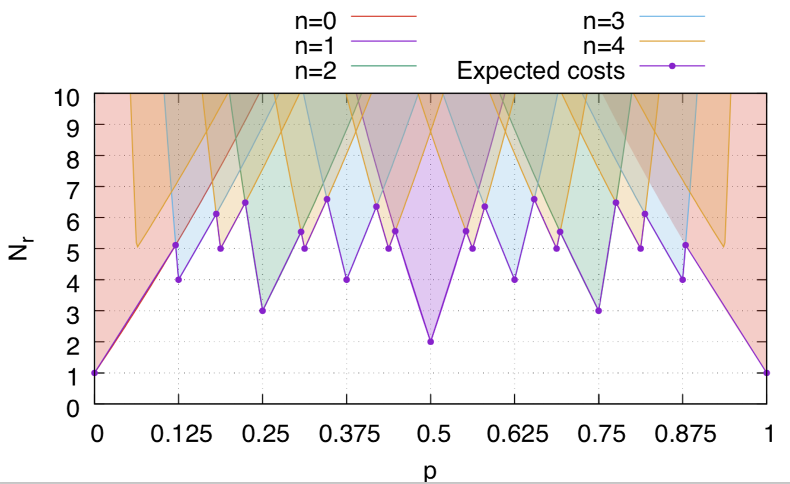

# Random Bit String Generator (RBS)

[](LICENSE)

This library generates a bit string whose bits are set randomly with an arbitral probability.

## How to use

Just include `randbit.hpp` and use it. The usage is

```cpp
rng::generator r(p);
```

where p is the probability. Then `r()` gives you a bit string in which each bit is set with the probability p.

A simple example is in [samples/simple](samples/simple) folder.

```cpp
#include <iostream>
#include <string>
#include <sstream>
#include <cstdint>
#include <iomanip>
#include <randbit.hpp>

std::string b2s(uint32_t bs) {
  std::stringstream ss;
  for (int i = 0; i < 32; i++) {
    ss << ((bs & (1 << (32 - i - 1))) ? 1 : 0);
  }
  return ss.str();
}

void test(const double p) {
  std::cout << "Probability p = " << p << std::endl;
  rbs::generator g(p);
  for (int i = 0; i < 5; i++) {
    uint32_t r = g();
    int nb = rbs::popcount(r);
    std::cout << b2s(r) << " ";
    std::cout << std::setw(2) << nb << " bits" << std::endl;
  }
  std::cout << std::endl;
}

int main() {
  for (int i = 0; i < 4; i++) {
    test((i + 1) * 0.2);
  }
}
```

The above codes will give you the following output.

```
Probability p = 0.2
00010000100000001001101001010100  9 bits
00100000010000100010010100000100  7 bits
00000000111000000100100000100010  7 bits
00000000000010010000100000000000  3 bits
11110101000110000000001011100000 12 bits

Probability p = 0.4
11010000110000011011101001011100 15 bits
11010000100000110101011101111001 16 bits
10101001110100110000000000000001 10 bits
10001110111001000001100000100011 13 bits
00000100000010011010100001000100  8 bits

Probability p = 0.6
11100010101100011011101111111110 21 bits
11110101110000110011111101111101 22 bits
11101001110100110000101110100101 17 bits
01001100111101000010100100001001 13 bits
01000011010010111110010111011110 18 bits

Probability p = 0.8
11100111111111111011111111111110 28 bits
11111000100101111011011111111111 24 bits
11101111111101100010101110111011 23 bits
11111111011110111110110111011110 26 bits
11111111000111111111111011111111 28 bits
```

## Application to one-dimensional bond-directed percolation

For demonstration, we apply this library to implement a multi-spin coding (MSC) technique of the one-dimensional Bond-directed percolation (1d-BDP).

### Cluster growth simulation

The source code for the cluster growth simulation of 1d-BDP is in [samples/cluster](samples/cluster) folder.
You can build and execute it as follow.

```
$ cd samples/cluster
$ make
$ ./a.out
serial        1637 [ms]
msc            382 [ms]
Speed up by 4.28534
```

Then you will have `simple.dat` and `msc.dat` which are the time evolutions of the number of active sites. You can obtain the graph of them as,

```
$ gnuplot cluster.plt
```

Then you will have the following graph.



### Relaxation process simulation

```
$ make
$ ./a.out
serial         956 [ms]
msc            383 [ms]
Speed up by 2.49608
```

Then you will have `simple.dat` and `msc.dat` which are the time evolutions of the number of active sites. You can obtain the graph of them as,

```
$ gnuplot relaxation.plt
```

Then you will have the following graph.



## How it works

This library adopts the Poisson-OR method and the correction. First, the given probability p is approximated by pn with a finite digit in the binary notation.

For example, suppose p is 0.6447, which is the critical density of 1d-BDP. The binary notation of p is

   0.6447 = 0.101001010...B

Then, we approximate p by 5/8 which is 0.101B. If we can generate bit strings xi in which each bit is set with the probability 1/2, then we can generate a bit string yn as

```math
yn = x3 | (x2 & x1)  
```

where yn is a bit string in which each bit is set with the probability 5/8.

Then we correct the difference between 0.6447 and 5/8 by the Poisson-OR method.
We first determine an integer number following the Poisson distribution with a parameter lambda = (p-pn)/(1-pn).
Then we take a logical OR between yn, x1, x2, ..., xk, i.e.,

```
y = yn | x1 | x2 | ... | xk
```

Then y will be the desired bit string. 

There exists the optimal number of the digit for approximation. The expected costs, which is an expectation value of a number of random number generation, is shown in the following figure.



The solid line denoted by "Expected cost" is the expected costs. The average number of random number generation is at most seven. Note that, this number may fluctuate following the Poisson distribution.

See our paper for details.

## Reference

"Fast algorithm for generating random bit strings and multi-spin coding for the directed percolation", H. Watanabe, S. Morita, S. Todo, and N. Kawashima, [arXiv:1808.05009](https://arxiv.org/abs/1808.05009)